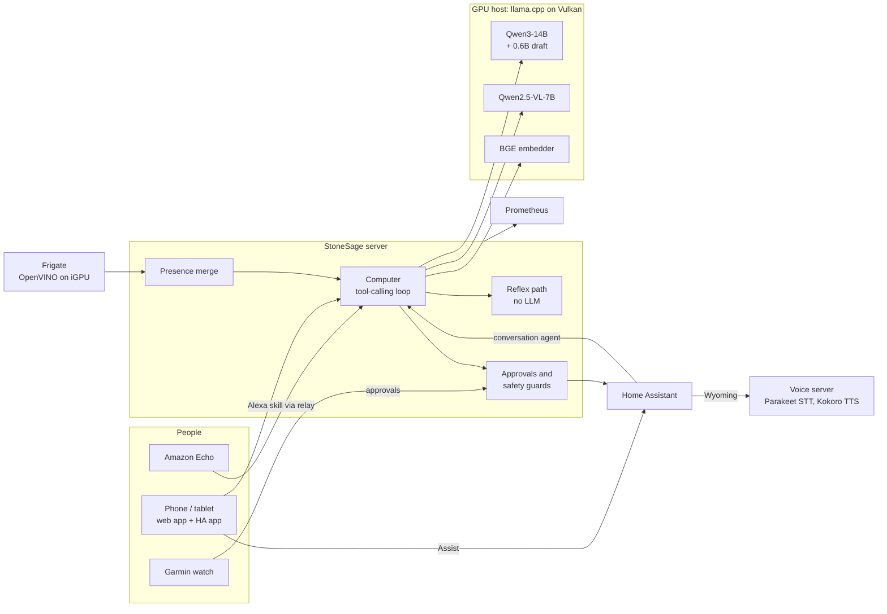

# StoneSage: a self-hosted home assistant that runs on its own GPUs

-red)

StoneSage is the control center of my homelab, and **Computer** is the assistant that lives in it: a dry, British,
slightly sarcastic house computer (named after the attic computer in *Courage the Cowardly Dog*). Computer answers
questions about the house, controls lights and the thermostat through Home Assistant, looks through the cameras, knows
who is home, and talks through the Amazon Echos, a phone or a tablet, with approvals on a Garmin watch.

Everything runs on hardware in the house: a two-node Proxmox cluster, two AMD GPUs serving the language and vision
models through llama.cpp, Frigate on an Intel iGPU for object detection, and Home Assistant for the devices. No cloud
LLM is involved in a normal turn.

The part I care most about is **making an LLM trustworthy enough to control a real house**, and measuring it rather
than hoping: every change to the agent is checked against deterministic evals, safety rules are enforced in code
rather than in the prompt, and latency is profiled down to where the time actually goes.

---

## What it does

- **Answers and acts.** "Is anyone home?", "Turn off the living room TV lights", "What's the temperature inside?",
  "Is the stove on?" (it looks). Orders given outright run at once; actions it *infers* ("it's cold in here") ask
  first; unlocking or opening the garage always asks, by voice, in the web chat, or as Yes/No buttons on the phone and watch.
- **Sees.** Frigate tracks people and pets on the cameras; Computer merges that with GPS (Life360) and camera patrols
  into one view of who is where, and a vision model reads a live frame when a question needs one. Wrong
  identifications can be corrected, and the correction teaches Frigate's face recognition.
- **Talks.** A voice pipeline with hands-free end-of-speech detection, sentences spoken while the answer is still
  being written, cached audio for common confirmations, and opt-in barge-in (talk over it to interrupt).
- **Speaks up on its own, rarely.** Greets people when they get home, at most six unprompted remarks a day, and holds
  them back when someone in the house is asleep (phone and watch signals, not a clock).
- **Keeps company.** Small talk, stories and advice, with a small memory of what people have told it.

## Architecture

| Layer | What runs there |
| --- | --- |
| GPU host (i7-12700K, RX 6750 XT 12 GB + RX 6600 8 GB) | llama.cpp: Qwen3-14B with a Qwen3-0.6B draft model (speculative decoding), Qwen2.5-VL-7B for vision, BGE-large embeddings, a small coder model; the voice server; Valkey |
| StoneSage (container) | Python stdlib HTTP server + a framework-free PWA: the agent loop, presence, patrol, commentary, approvals, metrics |
| Frigate (container, Intel iGPU) | Object detection with OpenVINO, 5.4 ms per inference |
| Home Assistant OS (VM) | Device control, the Assist voice pipeline (pointed at the voice server over Wyoming), Echo announcements |
| Metrics (container) | Prometheus: GPU busy and VRAM, engine idle, per-turn traces |

## Engineering highlights

**Safety in code, not in the prompt.** An early realistic test asked "Is the kitchen light on?" in a house with no
kitchen light; the model read the camera floodlight's state correctly, then offered to turn it on. Rather than
rewording the prompt, the loop now enforces it: a question is never treated as an order, an acting tool called after
a question is refused with an error the model has to answer, and a closing "shall I turn it on?" is cut from question
answers. Realistic-states eval: 7-8/9 before, 9/9 after, with tool choice unchanged.

**Evals with deterministic grading.** A 50-case tool-choice eval (single turn and mid-conversation) grades which tool
the model picks and whether it took any *wrong action*; a realistic-states eval runs the whole loop against Home
Assistant's real entities with actions recorded, never executed. No LLM judges: small local models grade too kindly.
Current coordinator: 48-49/50 with 0 wrong actions.

**Choosing models on evidence.** Candidate models are swapped into a spare GPU slot and run through the same evals:

| Model | Tool choice (single / mid-conversation) | Wrong actions | Decision p50 |
| --- | --- | --- | --- |
| **Qwen3-14B Q4_K_M** (live) | 45/46, 45-46/46 | 0 | 1.0 s |
| Granite 4.0 h-tiny (picked as the CPU stand-in) | 44/46, 41/46 | 0 | 0.51 s |
| Ternary Bonsai 2 27B (1.58-bit) | 44/46, 42/46 | 0 | 2.4 s |
| Ornith 1.5 9B | 43/46, 23/46 | **2** | 1.45 s |

The CPU stand-in matters: when a GPU is lent out for a long job, a lease hands Computer over to Granite on the CPU
(every action then asks for a yes) and hands it back when the GPU returns.

**Latency, measured and removed.**
- *Prompt caching:* the presence card (with a clock) sat before ~1,200 tokens of tool schemas, so every turn
  re-processed the whole prompt. Moving it after the static prefix: first model call 2.5 s to 0.5 s; "What's the
  temperature inside?" 6.8 s to 2.4 s end to end.
- *A model-free path:* a plain on/off order for a uniquely named device skips the LLM entirely. It was still 506 ms
  because it read Home Assistant's full state list four times; one shared read brought it to 35-55 ms.
- *Voice:* speech-to-text and text-to-speech moved from an old Xeon container to the GPU host after benchmarking
  (STT median 1.86 s to 0.28 s). End of speech to first audio for a light command: **356 ms median**, server side.

**Speech recognition picked on my own voice.** Synthetic clips only prove speed, so a recorder page captured 23
real phrases (names, devices, numbers, far-field) and every engine transcribed the same takes. The errors were names
("Kyla" for Kylo), so a household-name correction step fixes near misses without touching ordinary words:

| Engine | Word error rate | Names missed | Latency |
| --- | --- | --- | --- |
| **Parakeet TDT 0.6B + name correction** (live) | **2.6 %** | **0** | 134 ms |
| Parakeet as shipped | 5.1 % | 3 | 134 ms |
| Whisper base | 4.3 % | 0 | ~320 ms |
| Moonshine base | ~20 % | 0 | 42 ms |

**Talking over it without it interrupting itself.** Barge-in on a phone means the speaker's own audio leaks into the
mic. The page knows how loud Computer is at every instant (read from the WAV it is playing), learns how much of the
speaker reaches the mic, and only treats sound above that as a person; a take whose transcript is mostly Computer's own
words is thrown away. Tested headlessly with synthetic signals and in a real browser; a resampler test found a real
drift bug (15 extra samples per 2 s).

**Alexa without opening the house to the internet.** An Echo can only hand speech to code through an Alexa skill,
which needs an endpoint Amazon can reach, and the house is behind carrier-grade NAT. The skill (hosted free by Amazon)
seals each request and posts it to a public relay topic; StoneSage, which only makes outbound connections, reads it,
answers on a second topic, and announces late answers on the Echo. Messages are encrypted and authenticated with one
shared key (HMAC-SHA256, labelled per direction, replay window, rate limit); the Node.js skill and the Python server
are tested against each other in both directions.

**Knowing its own limits.** Prometheus records GPU load, VRAM and per-turn traces; an idle gate decides when a GPU may
be lent out (GPUs idle, no approval waiting, nobody awake); failed turns climb an escalation ladder that ends with an
honest "I got stuck" on the phone instead of a made-up answer.

## Testing

- **~500 unit tests** run with every non-localhost connection blocked (`python tests/run_tests.py`), so no test can
  touch the house or depend on it. CI runs them on Linux and Windows, Python 3.11 and 3.12.
- **Live evals** (`tests/live/`) run read-only against the real stack: tool choice, realistic states, companion
  quality, memory, commentary wording.
- **Mutation checks** on the safety-critical pieces: each guard is deliberately broken to confirm a test fails
  (for example 16/16 for the Alexa relay's sealing, replay and rate-limit rules).
- JavaScript (voice mode, barge-in, the Alexa skill) is tested in Node from the Python suite.

## Repository map

| Path | Contents |
| --- | --- |
| `StoneSage/backend/` | The server. `courage/` is Computer's agent loop (tools, approvals, reflexes, memory, escalation, trace); plus presence, patrol, commentary, metrics, engine lease, Alexa relay |
| `StoneSage/frontend/` | The web app: a Windows 95-style PWA in plain JavaScript (chat, voice mode, cameras, engine console) |
| `server setup/voice-server/` | Speech-to-text and text-to-speech server (FastAPI + Wyoming for Home Assistant) |
| `server setup/alexa-skill/` | The Alexa skill template and its build script |
| `server setup/frigate/`, `metrics/`, `vm-setup/` | Frigate config, Prometheus rules, systemd units for the GPU host |
| `stonesage-watch/` | Garmin watch app and face (Monkey C), Android companion (Kotlin), bridge |
| `harness/` | The command-line harness and shared libraries |
| `tests/` | Unit tests, JavaScript tests, live evals and benchmarks |
| `docs/` | Roadmap by phase, evaluation results, design notes |

Earlier experiments that are shelved and not part of the assistant (an autonomous "thinking loop", multi-agent
assembly, a fine-tuning pipeline) are still in the tree for reference.

## Status and roadmap

Working day to day: the agent loop, cameras and presence, the voice server, Home Assistant voice, approvals on phone and
watch, metrics. Built and tested but not yet proven on real hardware: barge-in on a phone speaker, and Echo requests
through the Alexa skill. The phase-by-phase plan is in [`docs/ROADMAP.md`](docs/ROADMAP.md) and the evaluation
results are in [`docs/evals/`](docs/evals/).

This is a personal homelab, not a product: addresses and hostnames in the code are on my own LAN, and the secrets it
needs live outside the repository.
